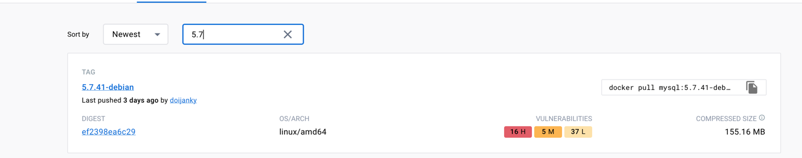

## docker安装mysql

- pull镜像

```shell
docker pull mysql:5.7.41
```

报错：
```shell
[root@centos1 network-scripts]# docker pull mysql:5.7.41
Trying to pull repository docker.io/library/mysql ...
5.7.31: Pulling from docker.io/library/mysql
5.7.31: Pulling from docker.io/library/mysql
no supported platform found in manifest list
```


原来是mysql5.7的镜像没有支持arm64

只能换到8.0

