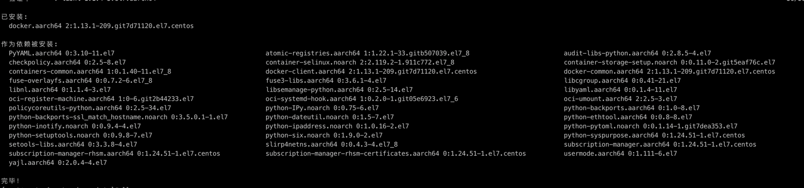
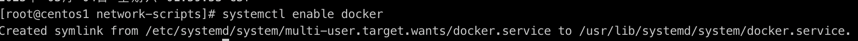
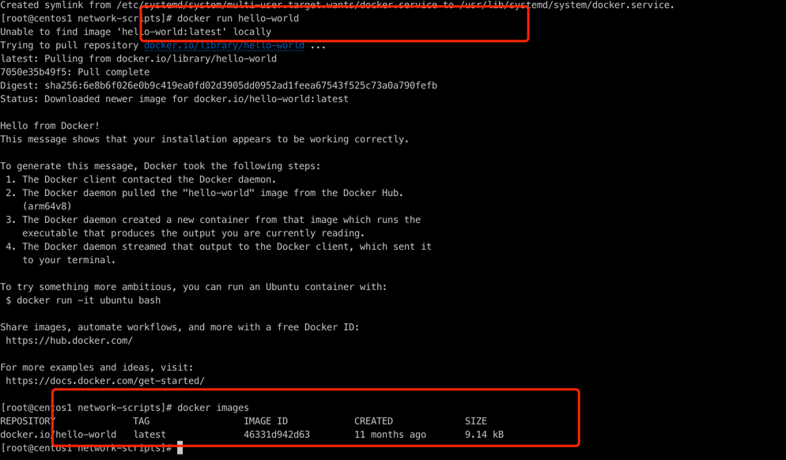
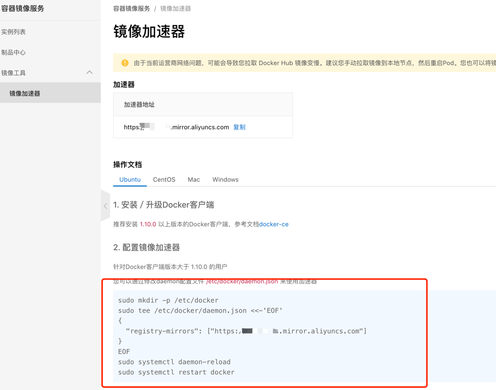
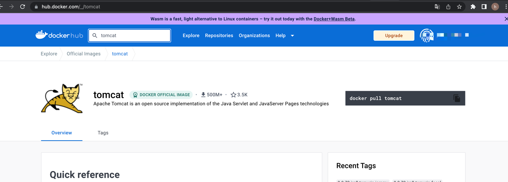
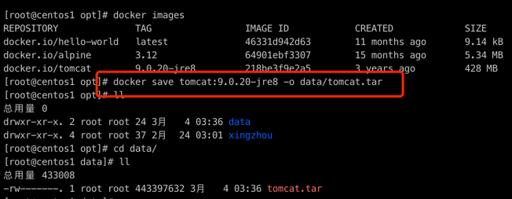
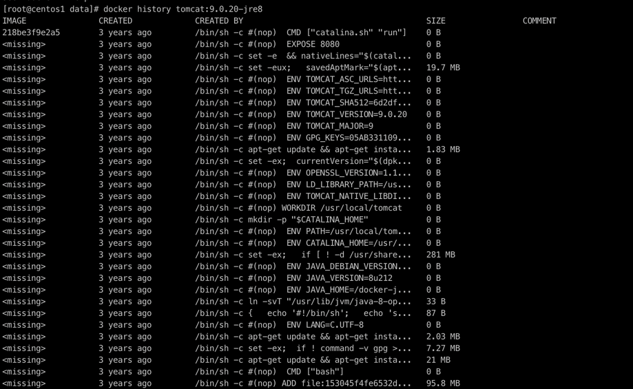
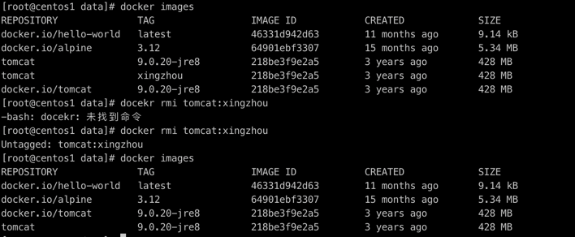
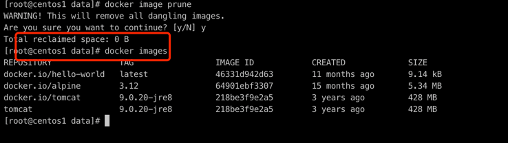

## docker

### docker安装

- 环境

硬件: aarch64

系统: centos7.9

- 安装

 ```shell
yum -y install docker
```

- 安装成功



- 查看version

```shell
docker -v
```

- 开启docker为服务

```shell
systemctl start docker
```

- 设置docker开启启动服务

```shell
systemctlenabledocker
```


- 试试hello-world

```shell
docker run hello-world

docker images
```



从仓库获取image，国内懂得都懂，访问会比较慢

- 配置阿里云镜像加速器

先去阿里云申请一个账号，登录之后在工作台搜索【容器镜像服务】找到【容器镜像服务】

```shell

sudo mkdir -p /etc/docker
sudo tee /etc/docker/daemon.json <<-'EOF'
{
  "registry-mirrors": ["https://你的地址.mirror.aliyuncs.com"]
}
EOF
sudo systemctl daemon-reload
sudo systemctl restart docker

```



- docker官方镜像

dockerhub: https://hub.docker.com/



docker占用磁盘空间，docker日志系统会占用磁盘空间，`定期清除`


### docker 进行常用命令

- 1. save
    
```
docker save tomcat:9.0.20-jre8 -o data/tomcat.tar
```



- 2. load
    
tar 转成镜像

```shell
docker load -i tomcat.tar
```

- 3. search
    
不建议使用， 不够直观

```shell
docker search tomcat
```

- 4. inspect
    
```shell
docker inspect tomcat:9.0.20-jre8
```


```json
[
    {
        "Id": "sha256:218be3f9e2a5f57a67f0e0a4bdc8ec41cb14f4380075eceb72b7841232f89b27",
        "RepoTags": [
            "docker.io/tomcat:9.0.20-jre8",
            "tomcat:9.0.20-jre8"
        ],
        "RepoDigests": [],
        "Parent": "",
        "Comment": "",
        "Created": "2019-05-16T01:32:53.23004899Z",
        "Container": "64e8b052781f42b7eb6825e648e9e12946652115e6857f61f4e0ca7d0e01f6c8",
        "ContainerConfig": {
            "Hostname": "64e8b052781f",
            "Domainname": "",
            "User": "",
            "AttachStdin": false,
            "AttachStdout": false,
            "AttachStderr": false,
            "ExposedPorts": {
                "8080/tcp": {}
            },
            "Tty": false,
            "OpenStdin": false,
            "StdinOnce": false,
            "Env": [
                "PATH=/usr/local/tomcat/bin:/usr/local/sbin:/usr/local/bin:/usr/sbin:/usr/bin:/sbin:/bin",
                "LANG=C.UTF-8",
                "JAVA_HOME=/docker-java-home/jre",
                "JAVA_VERSION=8u212",
                "JAVA_DEBIAN_VERSION=8u212-b01-1~deb9u1",
                "CATALINA_HOME=/usr/local/tomcat",
                "TOMCAT_NATIVE_LIBDIR=/usr/local/tomcat/native-jni-lib",
                "LD_LIBRARY_PATH=/usr/local/tomcat/native-jni-lib",
                "OPENSSL_VERSION=1.1.0j-1~deb9u1",
                "GPG_KEYS=05AB33110949707C93A279E3D3EFE6B686867BA6 07E48665A34DCAFAE522E5E6266191C37C037D42 47309207D818FFD8DCD3F83F1931D684307A10A5 541FBE7D8F78B25E055DDEE13C370389288584E7 61B832AC2F1C5A90F0F9B00A1C506407564C17A3 79F7026C690BAA50B92CD8B66A3AD3F4F22C4FED 9BA44C2621385CB966EBA586F72C284D731FABEE A27677289986DB50844682F8ACB77FC2E86E29AC A9C5DF4D22E99998D9875A5110C01C5A2F6059E7 DCFD35E0BF8CA7344752DE8B6FB21E8933C60243 F3A04C595DB5B6A5F1ECA43E3B7BBB100D811BBE F7DA48BB64BCB84ECBA7EE6935CD23C10D498E23",
                "TOMCAT_MAJOR=9",
                "TOMCAT_VERSION=9.0.20",
                "TOMCAT_SHA512=6d2df51f0bfc6a90cfca61c86473b8843da4162c430ab06b8f66f364931f3d8a3ad399703acdd600ff4f633d7d6725edf05d5d5d19534716a2f3f9f5238a32a0",
                "TOMCAT_TGZ_URLS=https://www.apache.org/dyn/closer.cgi?action=download&filename=tomcat/tomcat-9/v9.0.20/bin/apache-tomcat-9.0.20.tar.gz \thttps://www-us.apache.org/dist/tomcat/tomcat-9/v9.0.20/bin/apache-tomcat-9.0.20.tar.gz \thttps://www.apache.org/dist/tomcat/tomcat-9/v9.0.20/bin/apache-tomcat-9.0.20.tar.gz \thttps://archive.apache.org/dist/tomcat/tomcat-9/v9.0.20/bin/apache-tomcat-9.0.20.tar.gz",
                "TOMCAT_ASC_URLS=https://www.apache.org/dyn/closer.cgi?action=download&filename=tomcat/tomcat-9/v9.0.20/bin/apache-tomcat-9.0.20.tar.gz.asc \thttps://www-us.apache.org/dist/tomcat/tomcat-9/v9.0.20/bin/apache-tomcat-9.0.20.tar.gz.asc \thttps://www.apache.org/dist/tomcat/tomcat-9/v9.0.20/bin/apache-tomcat-9.0.20.tar.gz.asc \thttps://archive.apache.org/dist/tomcat/tomcat-9/v9.0.20/bin/apache-tomcat-9.0.20.tar.gz.asc"
            ],
            "Cmd": [
                "/bin/sh",
                "-c",
                "#(nop) ",
                "CMD [\"catalina.sh\" \"run\"]"
            ],
            "ArgsEscaped": true,
            "Image": "sha256:2dd8c7eafee1bc1901f9970f615b62d7255d38b7868135eb4c309578ce97a4ca",
            "Volumes": null,
            "WorkingDir": "/usr/local/tomcat",
            "Entrypoint": null,
            "OnBuild": null,
            "Labels": {}
        },
        "DockerVersion": "18.06.1-ce",
        "Author": "",
        "Config": {
            "Hostname": "",
            "Domainname": "",
            "User": "",
            "AttachStdin": false,
            "AttachStdout": false,
            "AttachStderr": false,
            "ExposedPorts": {
                "8080/tcp": {}
            },
            "Tty": false,
            "OpenStdin": false,
            "StdinOnce": false,
            "Env": [
                "PATH=/usr/local/tomcat/bin:/usr/local/sbin:/usr/local/bin:/usr/sbin:/usr/bin:/sbin:/bin",
                "LANG=C.UTF-8",
                "JAVA_HOME=/docker-java-home/jre",
                "JAVA_VERSION=8u212",
                "JAVA_DEBIAN_VERSION=8u212-b01-1~deb9u1",
                "CATALINA_HOME=/usr/local/tomcat",
                "TOMCAT_NATIVE_LIBDIR=/usr/local/tomcat/native-jni-lib",
                "LD_LIBRARY_PATH=/usr/local/tomcat/native-jni-lib",
                "OPENSSL_VERSION=1.1.0j-1~deb9u1",
                "GPG_KEYS=05AB33110949707C93A279E3D3EFE6B686867BA6 07E48665A34DCAFAE522E5E6266191C37C037D42 47309207D818FFD8DCD3F83F1931D684307A10A5 541FBE7D8F78B25E055DDEE13C370389288584E7 61B832AC2F1C5A90F0F9B00A1C506407564C17A3 79F7026C690BAA50B92CD8B66A3AD3F4F22C4FED 9BA44C2621385CB966EBA586F72C284D731FABEE A27677289986DB50844682F8ACB77FC2E86E29AC A9C5DF4D22E99998D9875A5110C01C5A2F6059E7 DCFD35E0BF8CA7344752DE8B6FB21E8933C60243 F3A04C595DB5B6A5F1ECA43E3B7BBB100D811BBE F7DA48BB64BCB84ECBA7EE6935CD23C10D498E23",
                "TOMCAT_MAJOR=9",
                "TOMCAT_VERSION=9.0.20",
                "TOMCAT_SHA512=6d2df51f0bfc6a90cfca61c86473b8843da4162c430ab06b8f66f364931f3d8a3ad399703acdd600ff4f633d7d6725edf05d5d5d19534716a2f3f9f5238a32a0",
                "TOMCAT_TGZ_URLS=https://www.apache.org/dyn/closer.cgi?action=download&filename=tomcat/tomcat-9/v9.0.20/bin/apache-tomcat-9.0.20.tar.gz \thttps://www-us.apache.org/dist/tomcat/tomcat-9/v9.0.20/bin/apache-tomcat-9.0.20.tar.gz \thttps://www.apache.org/dist/tomcat/tomcat-9/v9.0.20/bin/apache-tomcat-9.0.20.tar.gz \thttps://archive.apache.org/dist/tomcat/tomcat-9/v9.0.20/bin/apache-tomcat-9.0.20.tar.gz",
                "TOMCAT_ASC_URLS=https://www.apache.org/dyn/closer.cgi?action=download&filename=tomcat/tomcat-9/v9.0.20/bin/apache-tomcat-9.0.20.tar.gz.asc \thttps://www-us.apache.org/dist/tomcat/tomcat-9/v9.0.20/bin/apache-tomcat-9.0.20.tar.gz.asc \thttps://www.apache.org/dist/tomcat/tomcat-9/v9.0.20/bin/apache-tomcat-9.0.20.tar.gz.asc \thttps://archive.apache.org/dist/tomcat/tomcat-9/v9.0.20/bin/apache-tomcat-9.0.20.tar.gz.asc"
            ],
            "Cmd": [
                "catalina.sh",
                "run"
            ],
            "ArgsEscaped": true,
            "Image": "sha256:2dd8c7eafee1bc1901f9970f615b62d7255d38b7868135eb4c309578ce97a4ca",
            "Volumes": null,
            "WorkingDir": "/usr/local/tomcat",
            "Entrypoint": null,
            "OnBuild": null,
            "Labels": null
        },
        "Architecture": "arm64",
        "Os": "linux",
        "Size": 428447253,
        "VirtualSize": 428447253,
        "GraphDriver": {
            "Name": "overlay2",
            "Data": {
                "LowerDir": "/var/lib/docker/overlay2/6b1c436ef47a89f21c9af8d9e39503e84de222410df95cc0333418f53331039d/diff:/var/lib/docker/overlay2/9ade142b01838336ed40bf2b74b3deab0aaee635eefcfe56a275f14bfc2a2723/diff:/var/lib/docker/overlay2/3ce16444529ca74e41be79f45a07cd8582174be5c48b27f22ad56cdfe12a05a5/diff:/var/lib/docker/overlay2/a9c69b1723380d2a3645a57170db3b0be6ad361df3afc27782f9286797c7fffb/diff:/var/lib/docker/overlay2/0a265b012fdd373e81fd87ea95644f5f4e8a84b8ea1150479117d1e049a43999/diff:/var/lib/docker/overlay2/93028c67175fe9321ada1aea28192a540c8a26fb106c448eb77b34be6a0e181b/diff:/var/lib/docker/overlay2/aaa8338ece48d8bd0e64950f9ecc2a9600bf325fd9bc171438c30670e7e936c8/diff:/var/lib/docker/overlay2/14b17543a22ad9fa170daf2880a16a105cb5c9e6d9bb0eb652ea3666539d3b29/diff:/var/lib/docker/overlay2/4d13537581da517a862384579276356aded53442ca0e365c757d90ec58107672/diff:/var/lib/docker/overlay2/a93254fd71729d0c6518f7fdebd5f5ae284b84b5a886a092b12d0e4b19cdb74e/diff",
                "MergedDir": "/var/lib/docker/overlay2/edbcd8519af1b264b9091e56a59fdf16be20eb970efa2ba0aaf7b922420e47a7/merged",
                "UpperDir": "/var/lib/docker/overlay2/edbcd8519af1b264b9091e56a59fdf16be20eb970efa2ba0aaf7b922420e47a7/diff",
                "WorkDir": "/var/lib/docker/overlay2/edbcd8519af1b264b9091e56a59fdf16be20eb970efa2ba0aaf7b922420e47a7/work"
            }
        },
        "RootFS": {
            "Type": "layers",
            "Layers": [
                "sha256:ef9ee2bbae580cd8ce75e761a3d5fe29e3ff15b2585ff4ae69c9d8e56a1c8b9c",
                "sha256:b75d612a0865b66e3f09b13b18c5b28913c7c5d2aed0769122085ff49404c5fc",
                "sha256:ca88d05dec6b3725c7b655cf59b8a8decdc5e1c20f4d260ca7ade4ee8d718890",
                "sha256:7fec85ab84f3b9471a82092e606898f2068a96cfd6c26619548979ed50ffa920",
                "sha256:c552944514bb7dbb59f9a7d1f4cf7db8f0ab8af022656fdac503bd83faa3f384",
                "sha256:5e11c577471f42eedcfd9231000b4c5732b0466b3f7eaf255926b6ab43afdcb3",
                "sha256:eda9d03d758e2aa893cc63fb40fed01433399ff7d45a35b4b29c9dde08da1ffa",
                "sha256:18a6b630d0333a389f0bb2e9444b8ca4fc7f47f3264184cf38188be90846d03a",
                "sha256:784153024a3d4c61aeb42d1b5c876f33451ca91905759290b01550eeda37f85b",
                "sha256:5e190ed6cda65e7b0990c7fa08cf3482de17180cc42951f1f668a5fd9e07c806",
                "sha256:bdef9715ed9208d71da199bf4178a6319e340b00a1863cc9e953f2c97fb653a6"
            ]
        }
    }
]
```

- 4. history

通过 docker history命令，可以列出各个层的创建信息
```shell
docker history tomcat:9.0.20-jre8
```


- 5. tag

标记本地镜像，将其归入某一仓库.

```shell
docker tag tomcat:9.0.20-jre8 tomcat:xingzhou
```

- 6. rmi
    
```shell
docker rmi tomcat:xingzhou
```



我们在使用 Docker 一段时间后，系统一般都会残存一些临时的、没有被使用的镜像文件，可以通过以下命令进行清理。
执行完命令后，还是告诉我们释放了多少存储空间！

```shell
docker image prune
```


### docker容器常见命令

- 1. dockerrun[OPTIONS]IMAGE[COMMAND][ARG...]


 
    


